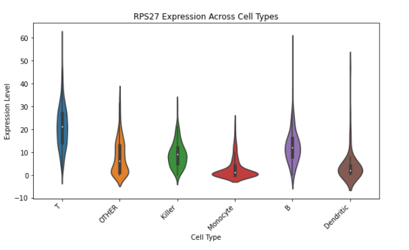
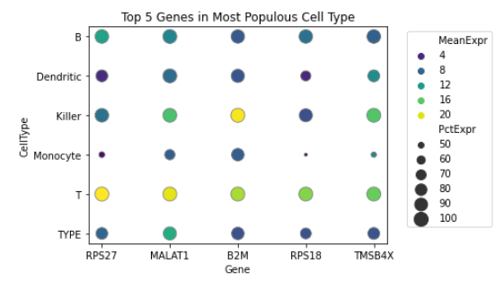

<a href="https://github.com/psaisan/PIPSCOUT/blob/main/notebooks/pip_data_analysis_pipeline.ipynb">
  
</a>

**PIPSCOUT** ( **PIP**seeker-based **S**ingle-**C**ell **O**utput & **UMAP** **T**yping ) is a Python-based tool (notbeook) designed to extract and reformat outputs from the proprietary [PIPseeker](https://pipseeker.readthedocs.io) pipeline for flexible downstream analysis. While PIPseeker efficiently processes single-cell RNA-seq data from raw FASTQ files through alignment, quantification, clustering, and cell-type annotation, its outputs are difficult to access and modify.

PIPSCOUT bridges this gap by:

- Extracting raw expression matrices, barcodes, clustering results, and annotations.

- Converting them into open formats compatible with tools like Scanpy and Seurat.

- Enabling custom dimensionality reduction (e.g., UMAP), re-clustering, and visualization.

PIPSCOUT is ideal for researchers who want to go beyond the defaults of vendor pipelines and explore single-cell datasets with full analytical flexibility.

## 📦 Requirements

- Python 3.x
- Python packages: `numpy`, `pandas`, `matplotlib`, `umap-learn`
- [PIPseeker](https://pipseeker.readthedocs.io) v2.1.4 installed at `/bioinformatics/pipseeker-v2.1.4-linux/`
- A genome annotation file such as `human-pbmc-v4.csv` in the PIPseeker directory

## ⚙️ Configuration

Edit the configuration block in the script to match your dataset setup:

```python
sample_name = 'sample2'          # Name of your sample (FASTQ prefix)
sensitivity = '3'                # Sensitivity level (1–5)
genome = 'human-pbmc-v4'         # Genome annotation file name (no .csv)
rerun = True                     # Set False if PIPseeker outputs already exist
```

##  Pipeline Overview

### 1.  🌌 Run PIPseeker and Decompress Outputs

Runs PIPseeker to align and quantify the single-cell RNA-seq dataset and then decompresses the outputs needed for downstream analysis.

- Command-line execution via `os.system`:
  - `pipseeker full` run with paths to FASTQ and reference index
  - Unzips `matrix.mtx.gz`, `features.tsv.gz`, and `barcodes.tsv.gz`

Output folder:  
`../results/<sample_name>_results/filtered_matrix/sensitivity_<sensitivity>/`

---

### 2.  🌌 Parse Genes and Barcodes

- Parses `features.tsv` to extract gene names.
- Parses `barcodes.tsv` to extract cell barcodes.
- Resulting Python lists: `genes` and `barcodes`.

Used for mapping indices to names and building matrix headers.

---

### 3.  🌌 Reconstruct the Expression Matrix

- Loads the `matrix.mtx` file (Matrix Market format) using `pandas.read_csv`.
- Initializes a dense NumPy matrix `M` of shape `(num_genes, num_cells)`.
- Populates `M` using the row, column, and value triplets in the `matrix.mtx`.

Result: A full gene × cell expression matrix (`M`) ready for downstream analysis.

---

### 4. 🌌 Perform UMAP Dimensionality Reduction

- Transposes `M` so that each row represents a single cell’s expression profile.
- Uses `umap.UMAP(n_components=12)` to embed the cells into a 12-dimensional latent space.
- Produces `embedding` — a 2D array of UMAP coordinates per cell.

UMAP enables visualization and clustering of cells based on gene expression similarity.

---

### 5.  🌌 Visualize Cell Types in 2D

- Loads cluster assignments from `clusters.csv` (one cluster label per cell).
- Loads cell-type labels from `graph_clusters.csv`, mapping cluster ID to known cell type.
- Plots a 2D UMAP projection using `matplotlib`, coloring points by cell type.
- Adds a legend identifying each cell type by color.

Final plot: A UMAP scatterplot with labeled cell clusters.

---

### 6.  🌌 Export Annotated Gene Matrix

- Combines barcodes with their corresponding cell types (e.g., `AACTT..._CD4_T_Cell`).
- Writes a new CSV file: `sample2_gene_matrix.csv`
  - First row: Annotated barcodes as column headers
  - Each subsequent row: A gene and its expression across cells

Output file is formatted for downstream analysis and includes both gene names and cell-type information.

---

## 📁 Output Files Summary

- `matrix.mtx`, `features.tsv`, `barcodes.tsv` — Raw PIPseeker outputs (decompressed)
- `clusters.csv`, `graph_clusters.csv` — Clustering and cell-type mappings
- `sample2_gene_matrix.csv` — Final expression matrix with cell-type-annotated barcodes
- UMAP plot — Visual summary of cell populations

---

## 💡 Use Cases

PIPSCOUT is ideal for:
- Visualizing and interpreting single-cell RNA-seq data 
- Linking clusters to known cell types
- Exporting labeled expression matrices for ML or statistical modeling

---

## 🎻 Single-cell Visualizations Made Simple

PIPSCOUT outputs annotated expression matrices, making gene-level visualizations like violin plots trivial.

The example notebook PIPSCOUT_violin.ipynb notebook shows how to:

- Identify top-expressed genes in major cell types
- Visualize their distributions across clusters

<table>
  <tr>
    <td>
        <a href="https://github.com/psaisan/PIPSCOUT/blob/main/notebooks/PIPSCOUT_violin.ipynb">
      </td>
    <td>
        <a href="https://github.com/psaisan/PIPSCOUT/blob/main/notebooks/PIPSCOUT_violin.ipynb">
      </td>
  </tr>
</table>
 


### :open_book: BibTeX Entry

```bibtex
@misc{talbert2025pipscout,
  author       = {Talbert, E. and Saisan, P.},
  title        = {PIPSCOUT: PIPseeker-based Single-Cell Output & UMAP Typing },
  year         = {2025},
  publisher    = {GitHub},
  howpublished = {\url{https://github.com/psaisan/PIPSCOUT}},
  version      = {0.1},
}
